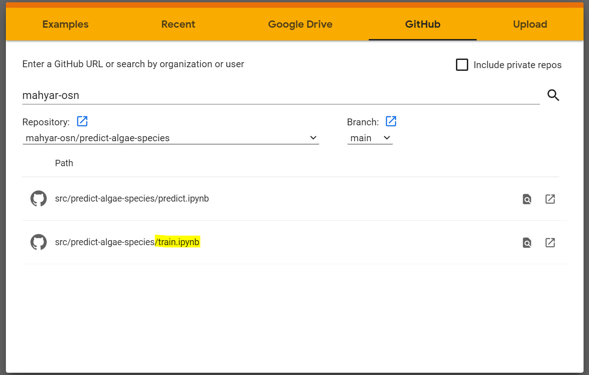
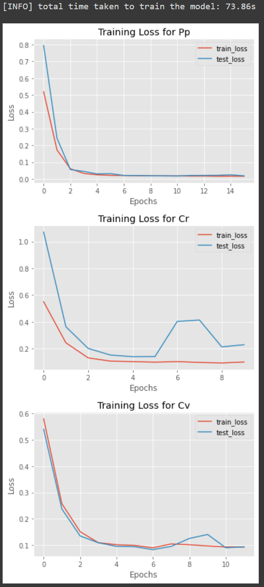
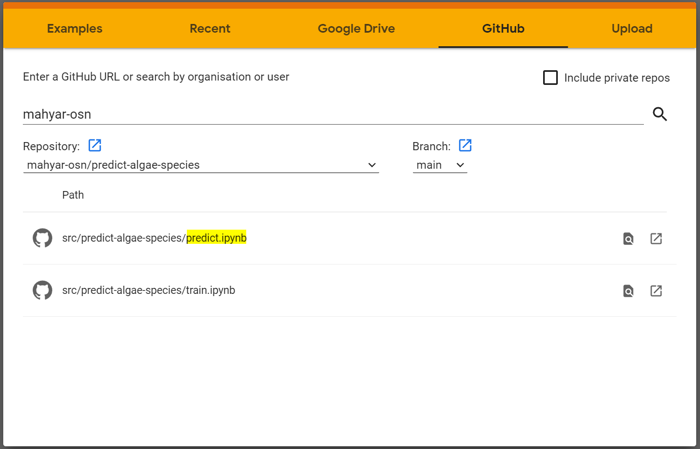
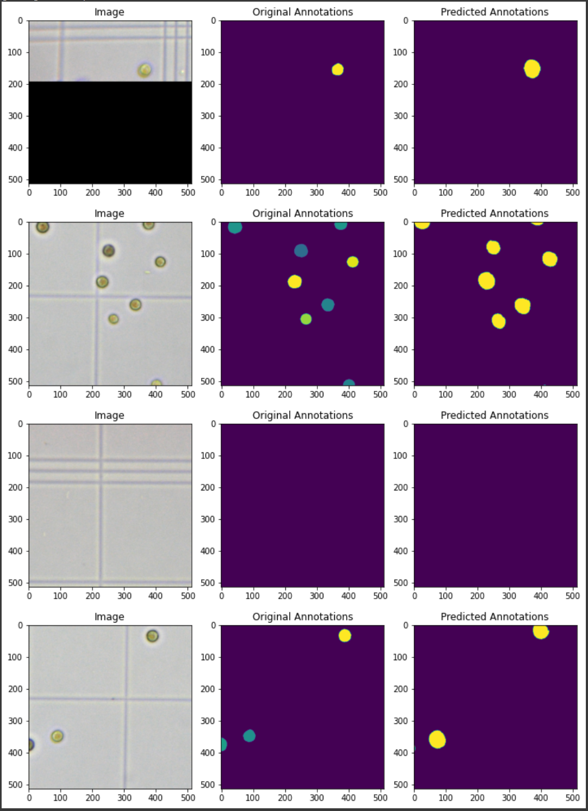

========
Overview
========

This repository contains Python codes and Jupyter Notebooks to train and predict algae cells using a ``Unet`` neural network model.

Requirements
------------

* `Python 3.9 <https://www.python.org/downloads/release/python-390/>`_.
* `PyTorch <https://pytorch.org/get-started/locally/>`_.
* `OpenCV <https://opencv.org/>`_.
* `Scikit-learn <https://scikit-learn.org/stable/>`_.
* `Numpy <https://numpy.org/>`_.
* `tqdm <https://tqdm.github.io/>`_.
* `Matplotlib <https://matplotlib.org/>`_.

* `DVC <https://matplotlib.org/>`_ (for metafile-based version controlling of dataset and models in CI/CD).

Dataset
------------
Dataset for this codebase are stored in a Google Drive folder. You can access it using this `link <https://drive.google.com/drive/folders/1-iU0YnifGsEuaKwUJbrxJktu0DLn8rFH?usp=sharing>`_.

- Note that you need to add the parent directory to your  ``My Drive``  folder by right clicking on the folder, selecting ``Add a shortcut to Drive``, and selecting ``My Drive``.

Instructions for training the model
------------

Rationale behind the training approach:
    - Since each algae strain contains different morphometric and image-level characteristics, I decided to create separate models for each strain. Each model will then be used to make inference for its corresponding algae image.

For simplicity, we will be using a Google Colab session.

* Open the training `notebook <https://githubtocolab.com/mahyar-osn/predict-algae-species>`_ and select ``train.ipynb`` as shown below (highlighted):

|

* Ensure that you initialise the session with GPU by ``Runtime -> Change runtime type`` and selecting GPU from the dropdown menu. Additionally select ``High-RAM`` from ``Runtime Shape``. Click save.

* Simply follow the instructions in the notebook to train the models.

* During training you should be able to monitor the progress like this:

 ::

    [INFO] found 135 samples in the training set...
    [INFO] found 45 samples in the test set...
    [INFO] training the network for Pp algae strain...
      0%|          | 0/40 [00:00<?, ?it/s][INFO] EPOCH: 1/40
    Train loss: 0.519692, Test loss: 0.7957

     Validation loss decreased (inf --> 0.795707). Saving model ...
      5%|▌         | 2/40 [00:32<08:53, 14.03s/it][INFO] EPOCH: 2/40
    Train loss: 0.172490, Test loss: 0.2425

     Validation loss decreased (0.795707 --> 0.242546). Saving model ...
      8%|▊         | 3/40 [00:36<05:55,  9.60s/it][INFO] EPOCH: 3/40
    Train loss: 0.060481, Test loss: 0.0554

     Validation loss decreased (0.242546 --> 0.055423). Saving model ...
     10%|█         | 4/40 [00:40<04:28,  7.47s/it][INFO] EPOCH: 4/40
    Train loss: 0.032661, Test loss: 0.0447

     Validation loss decreased (0.055423 --> 0.044656). Saving model ...
     12%|█▎        | 5/40 [00:45<03:42,  6.35s/it][INFO] EPOCH: 5/40
    Train loss: 0.024347, Test loss: 0.0297

     Validation loss decreased (0.044656 --> 0.029676). Saving model ...
     15%|█▌        | 6/40 [00:49<03:10,  5.62s/it][INFO] EPOCH: 6/40
    Train loss: 0.021112, Test loss: 0.0315

     EarlyStopping counter: 1 out of 5

|

* Once done, three plots are created for each model as follows:

|

Instructions for predicting cells
------------

Since our models are now saved in the Google Drive directory, we can simply run the ``predict.ipynb`` using another Google Colab session.

* Open the predicting `notebook <https://githubtocolab.com/mahyar-osn/predict-algae-species>`_ and select ``predict.ipynb`` as shown below (highlighted):

|

* For prediction, you do not need GPU, so let's just run the session with the default CPU.

* Simply follow the instructions in the notebook to predict. For the sake of demonstration, in the prediction each time we select a number of random images.

* Here is an exmaple of a Pp strain prediction:

|

A simple CI/CD workflow
------------
Here, I added a very simple ``CML`` using ``GitHub Actions``, ``DVC``, and ``Google Cloud Services``. Since we are storing the data and the trained models on a Google Drive folder, in order to make any `pull` or `push` tp that folder, Google will ask for authentication. In order to be able to download the model and test it automatically in CI/CD, ``Google Cloud Services`` was used.

Next, ``Google Cloud Services`` and ``DVC`` were configured so that we can automatically connect our version controlled models/dataset to our Google Drive folder. Using a simple `CML` workflow stored in ``.github/workflows/cml.yaml``, we can trigger an automated CICD each time we update our model or dataset. This is done through the ``GitHub Actions`` pull requests.

Each time the code/dataset are updated and pushed to codebase, our workflow in ``Actions`` is triggered. This results in a full run of installation and training of the model. Upon completion of the training, a text file called ``report.md`` is generated which contains some metrics to evaluate the training. In addition, a command will also be triggered to send an email to notify the user about the model training metrics. Furthermore, loss error plots are saved in the metrics so that the model performance can be evaluated offline.

Limitations
------------

- This is very simple Unet model with a small architecture. As a result, the predictions may not be 100% perfect and there may be mistakes. Additionally, no intricate and complex image-preprocessing and postprocessing have been applied to the images to make them more suitable for a convolutional neural network. To build better and more accurate models, we need i) an appropriate image processing pipeline to preprocess the images; ii) more complex models; iii) some regularisations in the model objective function; and iv) possible more cases to generalise the problem.

- The CI/CD pipeline is by no means a full comprehensive workflow. A complete workflow is much more complex than the one provided here, containing various other components such API wrappers, Docker containers, dynamic configuration files, model packaging systems, container registry, and prediction monitoring. Here I only tried to show a simple proof-of-principle. In addition, the codebase was tested and deployed on a Windows operating system and thus we cannot create Docker containers. This can be simply don on any Linux distribution systems.

